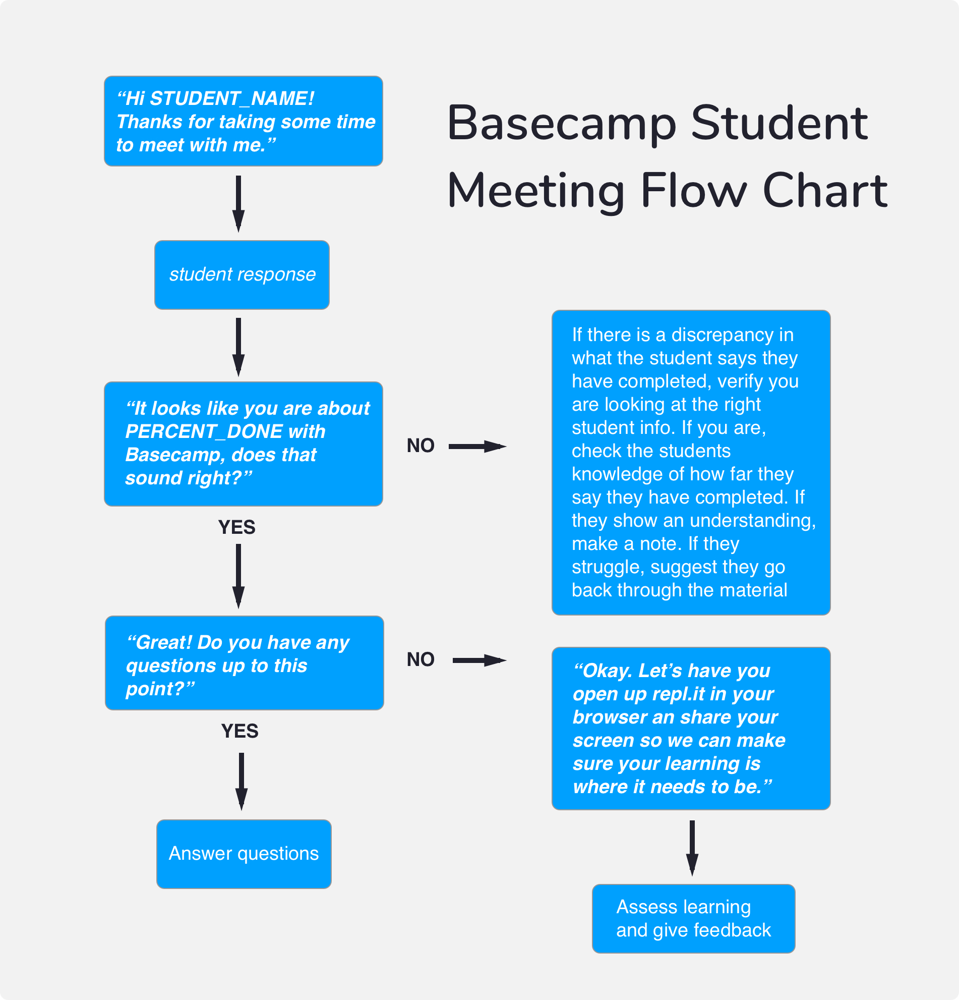

# Basecamp Mentor Guide

## Overview

 Basecamp is provided students to have them ready to hit the ground running come their first day of class at DevMountain. Basecamp will replicate what a student can expect once class does start. We will cover HTML, CSS, JavaScript, Computer Basics and even expose the students to Node and React so they can have a foundation come day one.

As mentors to Basecamp students, you will be some of their first point-of-contact to all things at DevMountain. It is expected that you will meet with each of your assigned students for 30 minutes a week for six weeks or whenever they are accepted to DevMountain. This contact should be convenient for both you and the student.

**Please keep all meetings professional**

## Helpful Tools for Meetings

There are a number of tools you can use to meet with your students. Here is a small list of what we recommend:

### Face-to-Face Meetings
* [Google Hangouts](https://hangouts.google.com/)
* [appear.in](https://appear.in/)

### Testing student learning
* [repl.it](https://repl.it/)
* [codeshare.io](https://codeshare.io/)

### Scheduling Meetings
Students must meet with you weekly. It is expected that you will attempt to contact a student at least three times during the week to schedule a meeting. If a student does not respond to your requests, please let Bryan Smith know immediately.

## Goals
The main goals for Basecamp meetings are as follows: 

* Test students on their learning.
* Review any content that the student isn’t grasping.
* Tips for success during their time at DevMountain and as a developer.
* Campus specific questions
* What they do or not like about Basecamp

## Payment
You will need to keep track of your time related to Basecamp. This includes scheduling meetings, emailing students and meeting with students. It will be your responsibility to track your time and enter it into Stella. A good option for keeping track of your time other than paper is [Harvest](https://www.getharvest.com/) which allows you to quickly turn your time on and off an takes out any guess work. They also have a generous free plan.

## Keeping track of student progress
Each time you meet with a student, please [fill out this form](https://goo.gl/forms/rhmE50afUBaMdEK72). Each part of the form is required and will be saved to a spredsheet. The form is broken down into
* Mentor Name
* Student Name
* Cohort - this can be found by asking the student or viewing the student breakdown given to you from Bryan Smith.
* Weeks until their cohort starts
* Did the student progress from the previous meeting (Mark yes for first meeting)
* Basecamp % Complete - This is a tough one in that you will have to do a little math. Within the [LMS](lms.devmountain.com) you can view student progress. It is broken down into 4 sections separated by quizzes so estimate where a student is at based off of their progress,
* Mentor Confidence in student on a 1-10 scale
* Notes for your meeting

The form can be filled out multiple times.

Please write complete and detailed notes. Things such as "Student is doing good" helps no one. Other Basecamp mentors, instructors and in-class mentors will rely on these notes to help assess understanding before the students start.

## Student progress

It is expected that students should progress through Basecamp. If you see that your student has stalled, please let me know ASAP so we can remedy the problem.

While completion of Basecamp has a very high priority, student comprehension is the most important. That is why weekly meetings with you the mentor are mandatory.

If you are having a difficult time contacting a student, please let me know so we can have myself or Admissions contact them to let them know their in-class spot may be in jeopardy.

## Curriculum Schedule

As talked about earlier, Basecamp is designed to give students a high level overview of what they will experience while attending DevMountain.

Students may progress through the Basecamp modules at different paces but a good schedule for students to adhere to would be this:

* Week One
    * Introduction
    * Computer Basics
    * Staying Motivated & Swallowing the Elephant
    * Computation Thinking vs Syntax

* Week Two
    * HTML & CSS Basics
    * Variables & Data Types
    * Operators
    * Conditionals
    * Functions

* Week Three
    * Stretch Project I
    * Scope
    * Objects
    * Methods

* Week Four
    * Arrays
    * Array Prototypes
    * Loops
    * Stretch Project II

* Week Five
    * Arrow Functions
    * Callbacks
    * Classes
    * Combining Knowledge to Solve Complex Problems

* Week Six
    * Node & NPM
    * Import Statements
    * Basic React
    * Intermediate HTML & CSS
    * Stretch Project III

### Weekly Questions for Student

Every single Basecamp meeting should include some form of coding from the student. If a student expresses they understand a topic, have them share their screen and demonstrate it. I would suggest starting each meeting with this script:

Here is a sample list of questions that you should ask a student each time you meet with them depending on their progress.

Week One

* Do you have VSCode Installed?
* Do you have git installed?
* Do you feel comfortable committing code?
* Basecamp is expected to take 40-60 hours over six weeks to complete. Do you feel you can commit to completing Basecamp before the first day of class?

Week Two

* HTML & CSS
    * How do you style HTML files?
    * How do you use a link tag in HTML?
    * What is the difference between class and ID?
* Variables & Data Types
    * What is a variable?
    * How do you declare variables?
    * What are data types?
    * How many data types can you name?
* Operators
    * What is an operator?
    * When should you use an operator?
* Conditionals
    * When would you use a conditional?
    * Have student nest conditionals
* Functions
    * What are functions?
    * How do you declare functions?
    * Difference between arguments and parameters?
    * Have student create function and invoke it

Week Three

* Did you complete stretch project and send it to basecamp@devmountain.com?
* Scope
    * What is scope?
    * What is the difference between global and local scope?
* Objects
    * Have student create an object
    * Add to an object using bracket and dot
* Methods
    * What are methods?
    * Invoke a method

Week Four

 * Arrays
    * What are arrays?
    * Can arrays hold different data types?
    * Can you add to arrays?
* Array Prototypes
    * How would you add to an array?
    * How would you make a copy of an array?
    * Review different prototypes with student
* Loops
     * When would we use a loop?
     * Have student create a for loop
     * Talk about using var/let when declaring for loop
* Did you complete stretch project II and send it to basecamp@devmountain.com?

Week Five

* Arrow Functions
    * Have student create an arrow function
    * Have student talk about implied return
    * Have student talk about when to use arrow functions
* Callbacks
    * What is a callback?
    * When will we use a callback?
    * Have student demo callback
* Classes
    * What is a class?
    * Have student create a class
    * Have student use constructor method

Week Six

* Node & npm
    * Is Node installed?
* Import Statements
    * Why would we use an import statement?
    * What is the es5< syntax to include something
* Basic React
    * Is create-react-app installed?
* Intermediate HTML & CSS
* Answer any questions the student may have
* Did you complete stretch project III and send it to basecamp@devmountain.com?

Please also add each student to the #web-precourse channel on Slack and let them know it is a great resource to get more feedback than their weekly meetings.

## Student FAQs
**What is Basecamp?**

Basecamp is a set of pre-course material for students before they attend DevMountain. Basecamp will help students set a pattern of accountability and will set the expectation of what their time at DevMountain will be like. We will be covering HTML, CSS, JavaScript and even basic React & Node. We will also cover the more basic things like picking a text editor and a file structure that will set students up for success.

**Will I have help during Basecamp?**

Absolutely! Learning to code can be difficult and we want to make this process as seamless as possible. Students will have access to weekly meetings with mentors to cover anything that might still be a little fuzzy.

**Does Basecamp cost anything**

Basecamp is provided at no additional cost to students. This is totally free with the cost of their tuition. We will be requiring that students do meet weekly with their Basecamp mentor to keep their in-class spot.

**Why am I having to do more pre-course work than someone who attended DevMountain before me?**

Basecamp is designed to create a solid foundation for students to become successful developers. The best way to learn to code is by doing. While there is more content than before, we also have given students more resources such as access to mentors and twice-weekly QA/Review sessions to help them during their time in Basecamp.

**How much time do I have to complete Basecamp?**

We will be giving students 6 weeks to complete Basecamp. We anticipate this will take anywhere between 40-50 hours to complete. This breaks downs to a little more than an hour per day, if the students choose to complete it that way. We will have mentors meeting with students weekly to make sure their learning is on track and set up for success once they attend DevMountain.

## Mentor FAQ
**When will I be paid for Basecamp?**

Basecamp will be paid bi-weekly. Be sure to enter your hours into Stella.

**Can I text and call my students?**

Go for it. Ideally, communication will be kept through email but if they aren't responding then alternative methods are fine.

**My student isn't responding to me, what should I do?**

If you go more than a week without hearing from your student, please reach out to Bryan Smith ASAP so we can remedy the problem.
